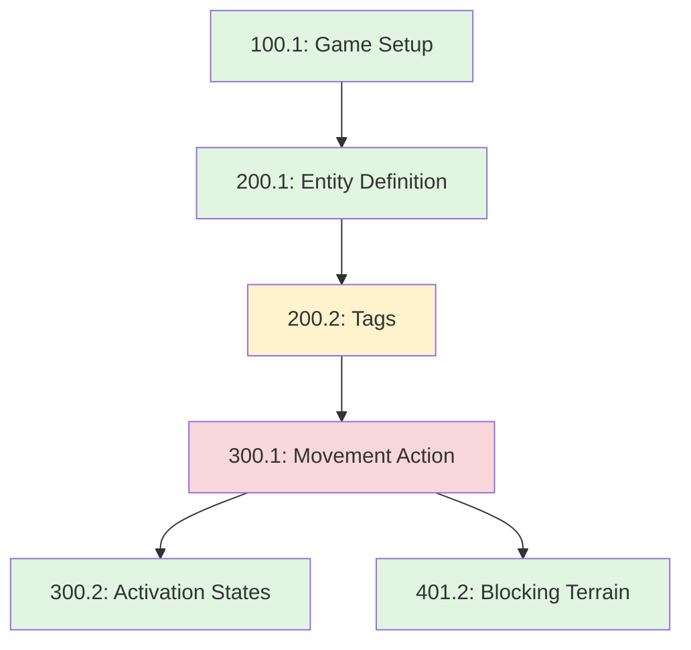

# Simple War Documentation Standard — Reference

## Required Document Section Templates

### Rules Documents

```markdown
# [Section Number]. [Section Name]

## Overview
[What this section covers]

## [Rule Number] [Rule Name]
[Rule statement]

### Examples
[Concrete examples]

### Edge Cases
[Known complications]

## Glossary Additions
[New terms introduced in this section]
```

### Entity Data Sheets

```markdown
## [Entity Name]

**Entity Type**: [Type]
**Tags**: [Tag list]
**Attributes**: [Attribute list]
**Composed Of**: [Sub-entities]
**Rules**: [Applicable rules]
**State**: [JSON schema]
```

### GDD Sections

```markdown
# [Number]. [Section Name]

**Status**: [Draft/Review/Approved/Implemented]
**Last Updated**: [Date]

## Purpose
## Overview
## Detailed Mechanics
## Examples
## Implementation Notes
## Version History
```

## Approved Phrasings

| ✅ Approved | ❌ Avoid |
|------------|----------|
| "When a Unit performs a Movement action, that Unit may move..." | "When you move, you can go..." |
| "Add 2 to the Unit's Movement value" | "The Unit moves faster" |
| "Resolve effects in turn order, starting with the Active Player" | "Both players do this at the same time" |
| "Units within 3 inches of the objective..." | "Units near the objective..." |
| "A Unit with the Flying tag ignores terrain" | "Flying units ignore terrain" |

**Sentence structure**: Prefer active voice; break run-ons into steps; avoid nested clauses like "Units that have tags that match..." → "Units with matching tags..."

## Validation Report Template

```markdown
# Documentation Validation Report
**Document**: [filename]
**Document Type**: [Rules/Entity/GDD]
**Date**: [validation date]

## Summary
- Total Sections: [count]
- Total Rules: [count]
- Errors: [count]
- Warnings: [count]
- Info: [count]

## Numbering Issues
[List any numbering problems with auto-fix suggestions]

## Cross-Reference Issues
### Broken References
[Rules or terms referenced but not defined]

### Forward References
[Terms used before definition — may be intentional]

## Glossary Issues
### Missing Definitions
[Terms that should be in glossary]

### Inconsistent Usage
[Terms used inconsistently]

### Duplicate Definitions
[Same term defined multiple ways]

## Style Guide Violations
### Errors
[Forbidden terms, ambiguous language]

### Warnings
[Style improvements needed]

## Dependency Issues
### Circular Dependencies
[Rules that reference each other cyclically]

### Deep Chains
[Rules with dependency depth ≥ 4]

### Missing Prerequisites
[Concepts used before introduction]

## Suggested Fixes
[Specific recommendations with examples]

## Auto-Fix Available
[Changes that can be automatically applied]
```

## Glossary Entry Format and Example

```markdown
**[Term]**: [Definition]. (Rule XXX.Y)
- See also: [Related Term 1], [Related Term 2]
```

**Example (alphabetical section)**:

```markdown
## A

**Activated**: An activation state where a Unit has performed its action for the turn and cannot activate again until reset. (Rule 300.1)
- See also: Activation State, Ready, Exhausted

**Active Player**: The player whose turn it currently is. (Rule 101.1)
- See also: Turn Structure, Priority

**Attribute**: A numerical or enumerated property of an Entity, such as Movement or Health. (Rule 200.3)
- See also: Entity, Derived Attribute
```

## Auto-Fix Examples

**Renumber**:
- BEFORE: `## 100.1`, `## 100.3`, `## 100.4` → AFTER: `## 100.1`, `## 100.2`, `## 100.3`

**Glossary entry** (detected term used 15×, not in glossary):
```markdown
**Active Player**: The player whose turn it is currently. (Rule 101.1)
- See also: Priority, Turn Structure
```

**Capitalization**: "When a unit with the flying tag..." → "When a Unit with the Flying tag..."

**Cross-reference**: "Movement is calculated based on the unit's speed." → "Movement is calculated based on the Unit's Movement value (see rule 300.1)."

**Links**: `[Movement Rules](#movement-rules)` (broken) → `[Movement Rules](#300-movement-and-positioning)` (fixed)

## Dependency Graph

### Mermaid Example



**Legend**: Green = low complexity (depth ≤ 2, width ≤ 3); Yellow = medium (depth 3, width 4); Red = high (depth ≥ 4, width ≥ 5).

### Dependency Matrix

| Rule  | Depends On              | Depth | Width |
|-------|-------------------------|-------|-------|
| 100.1 | —                       | 0     | 0     |
| 200.1 | 100.1                   | 1     | 1     |
| 200.2 | 200.1                   | 2     | 1     |
| 300.1 | 200.2, 300.2, 401.2     | 3     | 3     |

## Usage Scenarios

**Validate a rules document**: Parse structure → check numbering → validate cross-references → check style → analyze dependencies → generate report → offer auto-fixes.

**Update glossary**: Extract term definitions from context → generate entries → add cross-references → maintain alphabetical order → track usage; check for conflicts.

**Dependency graph for a subsystem**: Identify relevant rules (e.g. 400–499 for combat) → extract dependencies from text → compute depth/width → output Mermaid + matrix → highlight high-complexity rules and suggest simplifications.

**Format a new rule**: Assign rule number → apply sentence templates → fix terminology/capitalization → add Examples and Edge Cases → add cross-references → update dependency view and glossary if needed.
