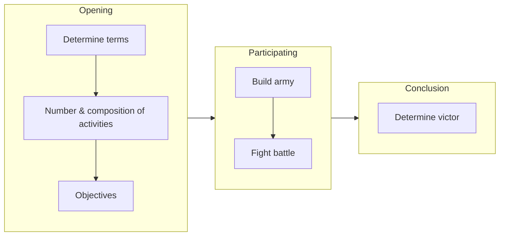
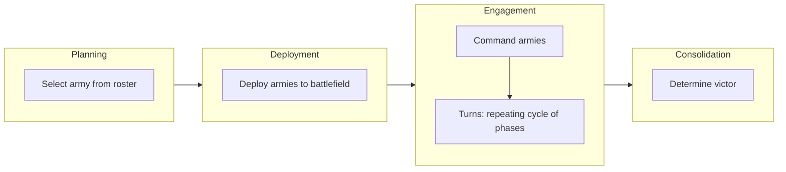
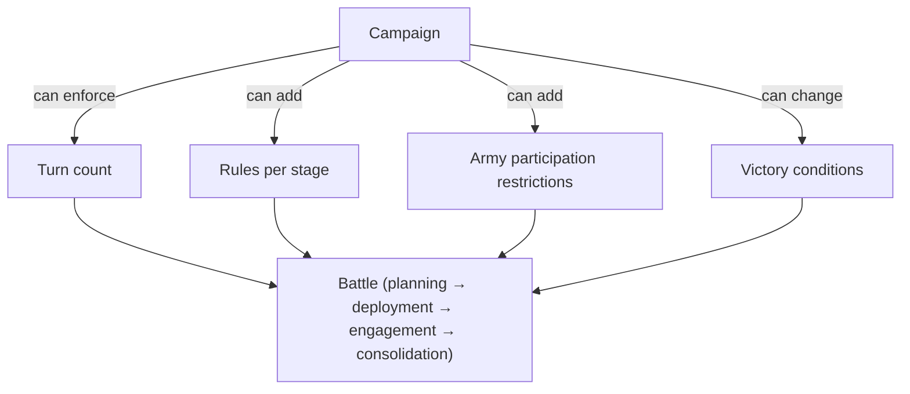
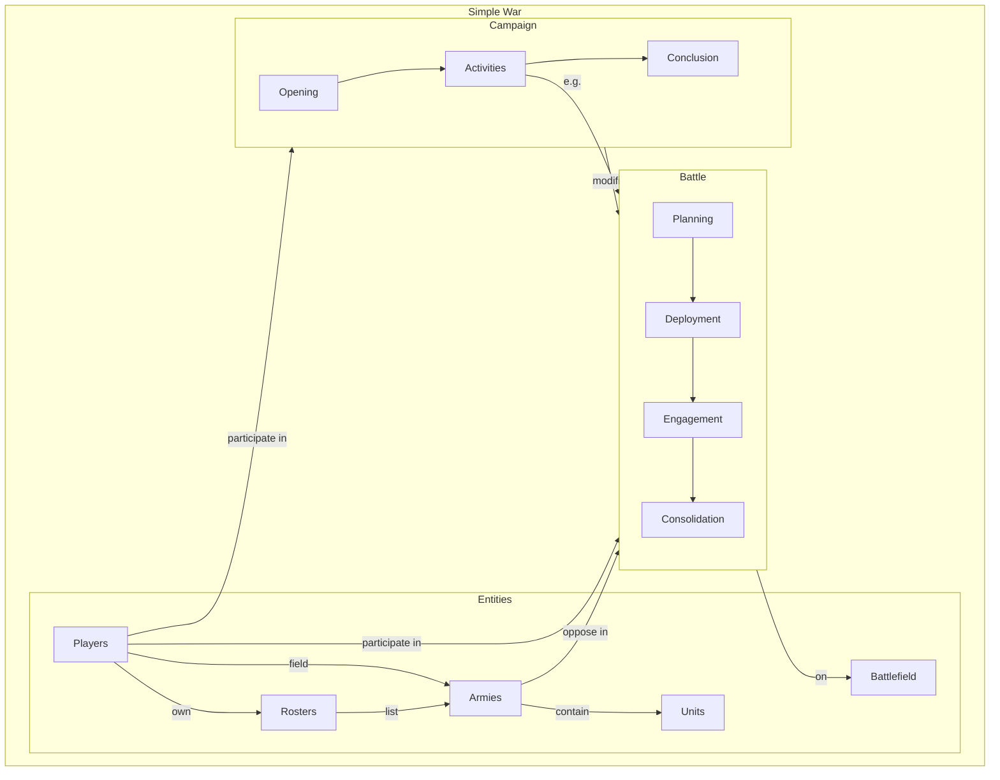

# Main Concepts — Entity & Activity Relationships

Diagrams derived from **Main Concepts**. Entities are the things; activities are what happens and how they connect.

---

## 1. Entities and relationships

```mermaid
erDiagram
    PLAYER ||--o{ ARMY : "fields"
    PLAYER ||--o{ ROSTER : "owns"
    PLAYER }o--o{ BATTLE : "participates in"
    PLAYER }o--o{ CAMPAIGN : "participates in"

    ROSTER ||--o{ ARMY : "lists"
    ROSTER {
        list of armies
        optional build restrictions
    }

    ARMY ||--o{ UNIT : "contains"
    ARMY {
        army list
        army value
    }

    BATTLE }o--|| BATTLEFIELD : "fought on"
    BATTLE }o--o{ ARMY : "opposing"
    BATTLE }o--|| CAMPAIGN : "part of"

    CAMPAIGN {
        opening
        activities
        conclusion
    }

    BATTLEFIELD {
        single per battle
    }
```

- **Players** field **Armies** and fight **Battles**. Armies live in a **Roster**; battles happen on a **Battlefield**. Together these form a **Campaign**.
- **Roster**: list of armies; may impose build restrictions (default: none).
- **Army**: built from **Units** (army list), has an army value; two opposing armies of similar value fight on one battlefield until one is wiped out.

---

## 2. Campaign structure (activities and flow)

A **Campaign** is how gameplay is organized: opening → participating in activities → conclusion.



- **Opening**: terms of the campaign, number/composition of activities, objectives.
- **Participating**: e.g. each player builds an army, then they fight a battle.
- **Conclusion**: determine the victor. Campaigns can add, remove, or modify these activities.

---

## 3. Battle stages

Fighting a battle has four stages. Campaign or army rules can add steps or modify how each stage works.



- **Planning**: choose which army from the roster is used.
- **Deployment**: put that army on the battlefield.
- **Engagement**: command armies in **turns** (repeating phases) until one army is wiped out (or campaign rules say otherwise).
- **Consolidation**: decide who won. Campaign can change victory conditions, turn count, stage rules, or who can participate.

---

## 4. Where campaigns can modify battles

Campaigns sit above battles and can change how battles run.



---

## 5. One-page overview



---

*Source: Game Design Document — Overview / Main Concepts*
